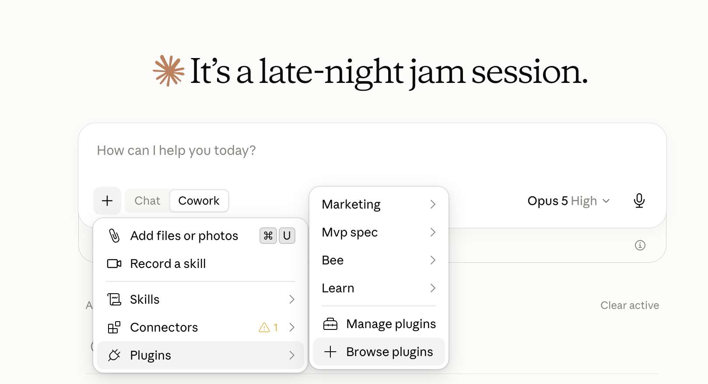
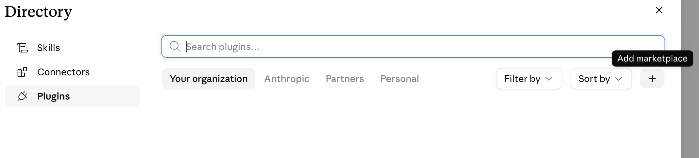
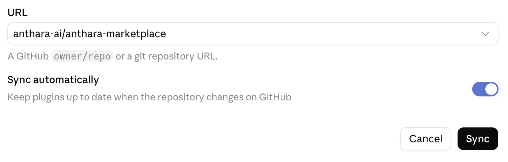
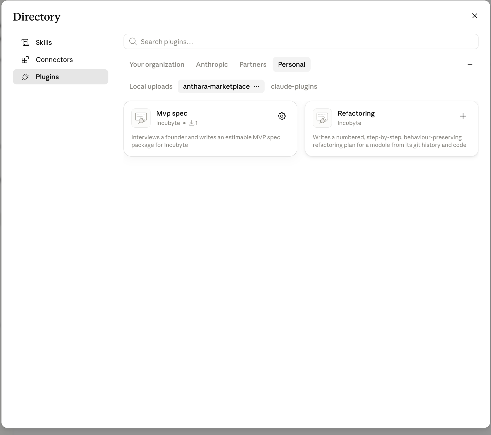

# Anthara marketplace

A plugin marketplace for Claude Cowork and Claude Code. Each plugin lives in its own directory at the root of this repository and is listed in `.claude-plugin/marketplace.json`.

## Plugins

| Plugin | What it does |
|---|---|
| [`mvp-spec`](mvp-spec/) | Interviews a startup founder and writes an estimable MVP spec package for Incubyte |
| [`refactoring`](refactoring/) | Writes a numbered, step-by-step, behaviour-preserving refactoring plan for a module from its git history and code, and can present it as a self-contained HTML page |

## Install a plugin

This repository is a marketplace, so it works in both Claude Cowork and Claude Code. Add the marketplace once, then install the plugins you want from it. Each plugin's README explains how to use it: [`mvp-spec/README.md`](mvp-spec/README.md) and [`refactoring/README.md`](refactoring/README.md).

### Claude Cowork

1. In the composer, click **+**, then **Plugins**, then **Browse plugins**. This opens the plugin Directory.

   

2. Click **+** next to the marketplace tabs (**Your organization** / **Anthropic** / **Partners** / **Personal**) to **Add marketplace**.

   

3. Enter `anthara-ai/anthara-marketplace` (a GitHub `owner/repo`, or the full URL) as the URL, leave **Sync automatically** on so plugins stay up to date when the repository changes, and click **Sync**.

   

4. `anthara-marketplace` now appears as its own tab in the Directory, listing `mvp-spec` and `refactoring`. Click the **+** on a plugin's card to install it.

   

5. Start mvp-spec from the composer's **+ → Plugins** menu, or by invoking its **start** skill (`/mvp-spec:start`) in a new task.

See the [Cowork plugin docs](https://claude.com/docs/cowork/guide/plugins) for details, including uploading a plugin from a file and organization-managed plugins.

### Claude Code

```text
/plugin marketplace add anthara-ai/anthara-marketplace
/plugin install mvp-spec@anthara-marketplace
/plugin install refactoring@anthara-marketplace
```

Start a new Claude Code session afterwards and the plugin's skills are available; begin mvp-spec with `/mvp-spec:start`, or plan a refactoring with `/refactoring:plan <module>`. See the [Claude Code plugin docs](https://code.claude.com/docs/en/discover-plugins) for more.

If this repository is private, whoever installs from it needs GitHub access to it.

## Local development

To try a plugin from a local checkout without installing it:

```bash
git clone https://github.com/anthara-ai/anthara-marketplace.git
cd anthara-marketplace
claude --plugin-dir ./mvp-spec
```

Edits to the plugin's files take effect the next time Claude Code starts.

## Add a plugin to the marketplace

1. Create a directory at the repository root named after the plugin, containing `.claude-plugin/plugin.json` and its `skills/`, `agents/`, `commands/` or `hooks/` as needed.
2. Add an entry to `.claude-plugin/marketplace.json`:

   ```json
   {
     "name": "plugin-name",
     "source": "./plugin-name",
     "description": "One line on what it does"
   }
   ```

3. Give the plugin its own `README.md` with install and usage instructions.
